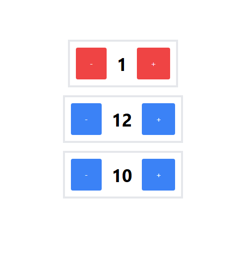

#Counter(React)

## About

This is a simple counter app built with React.

## Features

- Simple Counter
- Step Counter
- Danger Counter

## Customization

- You can customize the color of the button by adding the className `red` to the button.
- You can customize the text color of the button by adding the className `text-white` to the button.
- You can customize the background color of the button by adding the className `bg-blue-500` to the button.

## Screenshots

## Tech Stack

- HTML
- CSS
- React Js

## Use

1. Clone the repository
2. Go to the directory
3. Run the command `npm install` to install the dependencies
4. Run the command `npm run dev` to start the application
5. Open the browser and go to `localhost:3000` to view the application

## License

    MIT License
